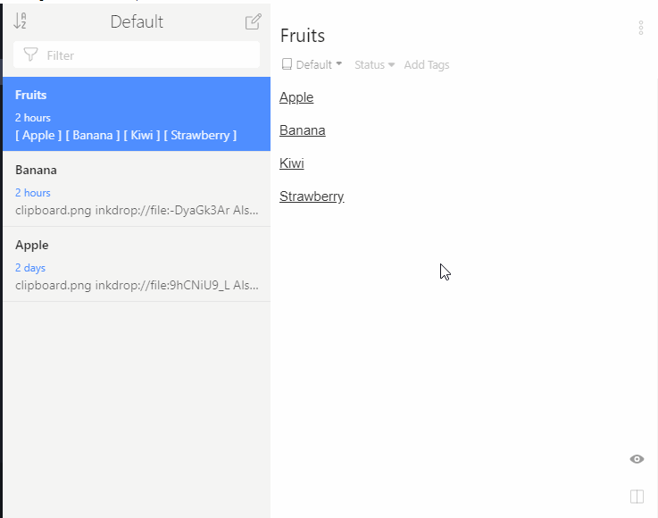

# wiki_links

Add `[[Wiki]]` style links to Inkdrop.

## Usage

### Wiki Links

You can write Wiki style links to internal notes, like this:

    [[Foo]]

If the note does not exist, it will be created.

